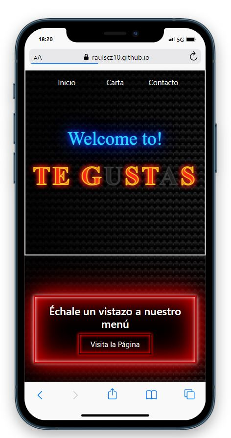
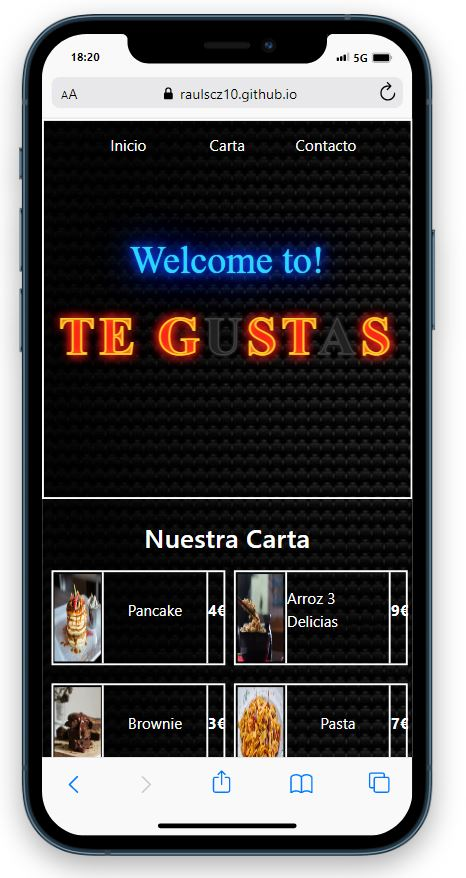
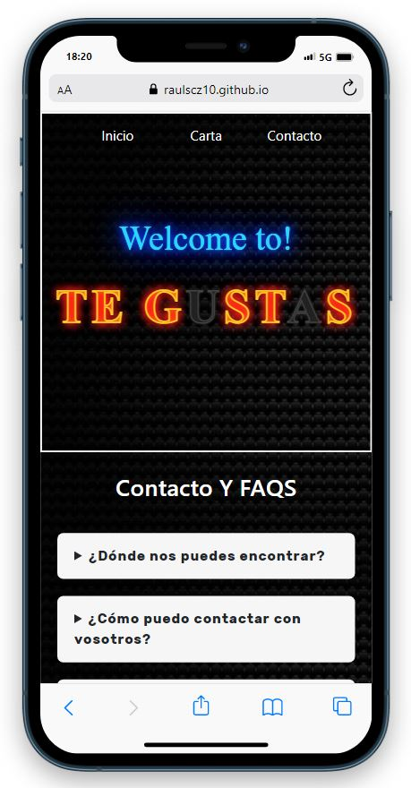

## 📝 Tabla de Contenidos

- [Introducción](#Introducción)
- [Pre-requisitos](#Pre-requisitos)
- [Construido con](#Construido)
- [Uso](#uso)
- [Demo](#Demo)
- [Capturas de Pantalla](#CapturasdePantalla)
- [Contacto](#Contacto)

## Introducción 🧐 

Mi segundo proyecto realizado en el Bootcamp Full Stack Developer en el que tenía que realizar una página web simulando un restaurante. La web esta formada por un home, una página que simula nuestra carta y por último una página de contacto todo con su respectivo responsive.

## Pre-requisitos 📋 

    · Editor de Texto -> Visual Studio Code
    · Descargarse la extensión de Live Server para Visual Studio Code

## Construido con 🛠️ 

Este proyecto ha sido creando utilizando los siguientes lenguajes:

    · HTML
    · CSS
    · Bootstrap

## Uso 🛠️

    El uso de la aplicación es sencillo. Al entrar veremos la página de Home, donde podremos navegar a las demás usando la barra de navegación de arriba o los dos botones que hay en el contenido. En las demás páginas solo pondremos ver el contenido, en la carta al pasar por encima de los platos tendremos un efecto de zoom y en la de contacto unos desplegables.

## Demo 👀 

Para visualizar la demo <a href="https://raulscz10.github.io/digital-menu-restaurant/" target="_blank"> clic aqui </a>.
## Capturas de Pantalla  📸 

A continuación os dejo una preview de como ha quedado el proyecto.

Página Home.

Página de la Carta.

Página de la Carta.

## Contacto 📧 

En caso de que tengáis alguno o queráis hacer algún aporte al código, podéis escribirme a mi correo.

    · raulscz10@gmail.com